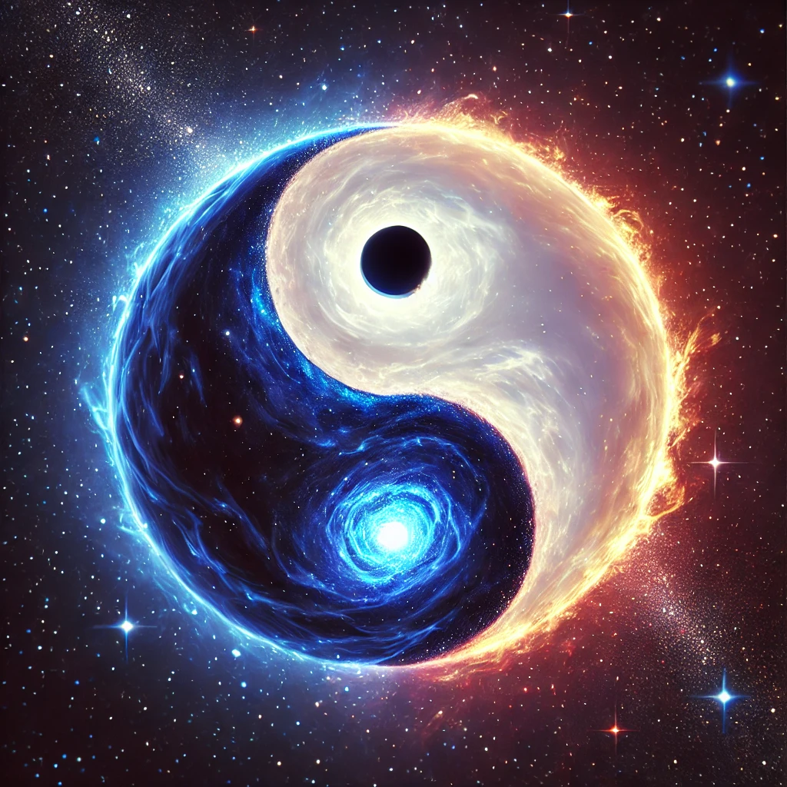
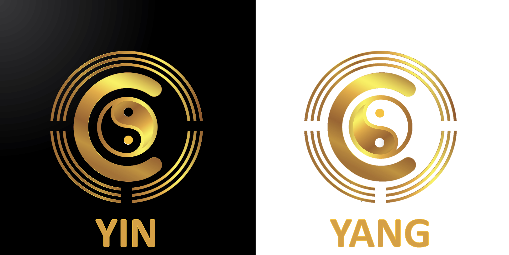
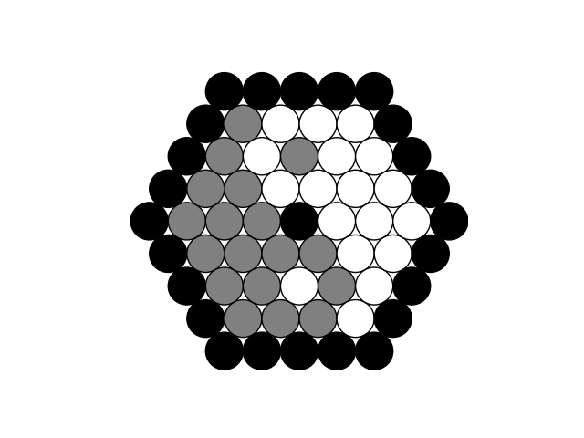
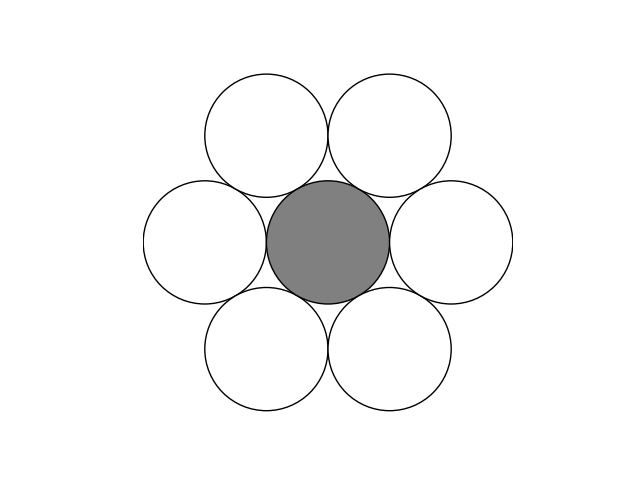
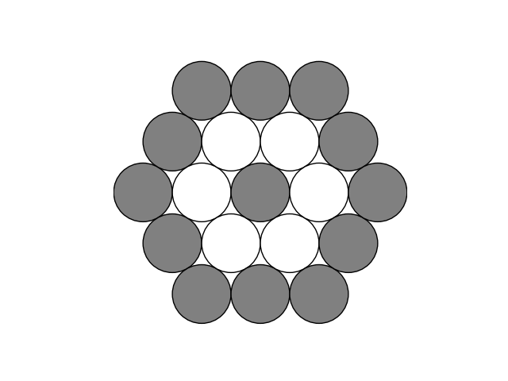
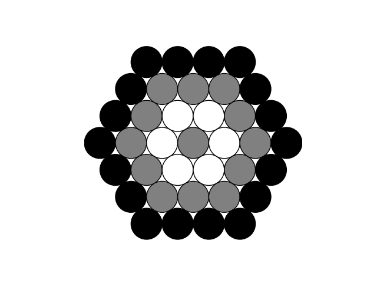
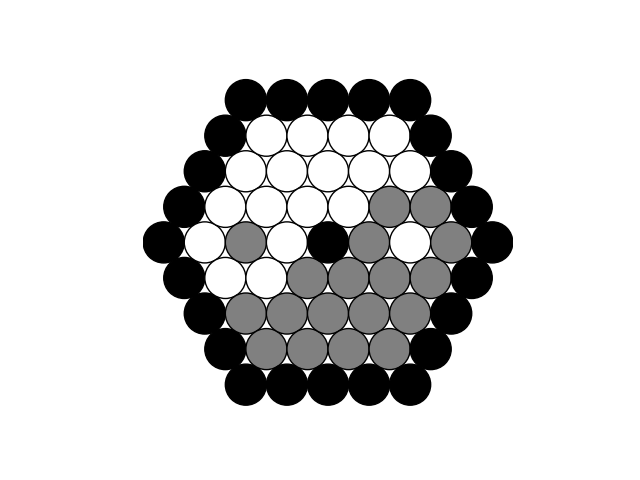

# circaevum-dao-phase-1
The Yin Yang (Taiji) Inspired Smart Contract for Phase 1 of Circaevum's DAO Governance - to be launched on February 28, 2025 - on the Grand Planetary Parade where all 7 planets will appear in a line in the sky. First quarterly meeting will be sometime late March or early April 2025.

**Abstract**:
On a Quarterly basis, contributions towards the evolution of Circaevum will be tallied, future work will be scoped, votes will take place, revenue will be dispersed, and equity will shift.

This Yin-Yang inspired model is designed to:
- Provide a framework to simplify and streamline this process
- Incentivize long-term contributions
- Keep the company lean and balanced
- Provide an intuitive model for equity distribution
- Serve as a flywheel for innovation and growth
- Be visualized using Circaevum, naturally

Circaevum is a 3D graphics engine for Time. A system to aggregate, index, visualize, and navigate TimeStamps across datasets. As the Solana Blockshin emphasizes the use of TimeStamps for its Proof of History (PoH) consensus mechanism, this is a fitting system to incorporate Circaevum as a DAO with respect to. The Circaevum DAO is a Realms' Community Token DAO on the Solana blockchain, and can be found here: https://app.realms.today/dao/FDerj19PyQytsD1rL4NGpSeXWT8d7WdRABBxxCEnDj6d

---

### Yin-Yang Characteristics
**Yin**: Adaptive, darkness, source of emergence
- Yin represents the individual. Using a typical scrum model, story points are evaluated and attributed to development tasks, and 1 YIN token is awarded for each story point. 750 story points (750 YIN tokens) are equivalent to 1 YANG token, and can be converted to YANG at any time as long as YANG eligibility permits.
- YIN is the Community Token in Realms' Community Token DAO configuration.
- This takes up half of a Yin Yang, with a small hole where Yin coagulates into a ball of Yang, which is independent of the other half of the Yin Yang, which also includes a hole

**Yang**: Conservative, resistant to change, source of decay, full of light and density
- Yang represents the company. The overall company is a ball of energy with inertia, and it needs to shed effectively 1 YANG token per quarter to offer incentive to the YIN pool. For the early core development, YANG will be shed initially from Adam's initial shares, and then once those balance with those disspersed, YANG will begin to shed from the YANG pool.
- YANG is the Council Token in Realms' Community Token DAO configuration.
- The hole in Yang is to represent the portion of Yang that is lost to make way for the proportional incoming Yang.

### Token Characteristics
---
| Token Type                          | Percentage Cap | # of Tokens Issued | Governance? | Equity? | Profit-Sharing? | Conversion Possible? | Transferable? | Burnable? | Decay Mechanic?                          |
|-------------------------------------|----------------|--------------------|-------------|---------|-----------------|----------------------|---------------|-----------|------------------------------------------|
| Taiji Point                         | 2.71%          | 1                  | ✅ Yes      | ✅ Yes  | ✅ Yes          | ❌ No                | ✅ Yes        | ✅ Yes    | ❌ No                                   |
| YANG                                | 2.7%           | 18                 | ✅ Yes      | ✅ Yes  | ✅ Yes          | ✅ Yes               | ✅ Yes        | ✅ Yes    | ✅ Yes (if inactive before fully earned) |
| YIN                                 | 0.9%           | 13,500             | ❌ No       | ❌ No   | ✅ Yes          | ✅ Yes               | ✅ Yes        | ✅ Yes    | ✅ Yes (depletes if inactive)            |
---

### Yin-Yang Geometry
- In a standard Yin Yang model when examined along a line that bisects the center and each of the smaller circles, there are 6 equal segments of equal length in progression: White, Black, White, and then Black, White, Black. The single Black within the first half represents the diameter of the inner black circle (the Yin [black] within the surrounding Yang [white]). The single White within the second half represents the diameter of the inner white circle (the Yang [white] within the surrounding Yin [black]).
- Using this geometry, we can assume that if the radius of an inner circle is 1 (½ of diameter), then the radius of the full circle is 6. 
- Knowing this, the area of an inner circle is PI*r^2, or in this case PI*1^2. The area of the full circle is PI*6^2. To find the percentage of the inner circle to the outer, we find ourselves with (PI*1)/(PI*36), which simplifies to 1/36, or 2.77%
- When stacking 36 circles, the hexagonal arrangement naturally finds balance with 37 circles (one in the middle). Naturally, this comes as a simple way to establish the CEO role as the 37th circle. With 1/37 = 0.027027027 repeating, to make it simple 2.7% is attributed to each circle, with the remainder added to the CEO's share (2.71%)to serve as a tie breaker in close votes.

(imagine each of the gray circles [YIN] is actually 750 circles stacked on top of each other)

**Taiji Point**:
- The Taiji Point is the center of the Yin Yang, and represents the CEO. The Taiji Point is the only token that is immune to decay mechanics.

## Growth Progressions
### Round One: Outer Core - First 6 team members (CEO is Inner Core)

Each Outer Core team member can earn up to 5.4% (two YANG tokens), and can be burned at a rate of 0.45% per quarter (0.45% x 6 = 2.7%). In total, their value in the company equals 32.4%. Until the Core is full, each Outer Core member will get 14% of the voting rights, and the Inner Core will get 16% in voting rights to total 100%.

| Member Type    | Count | Voting Power per Member (%) | Total Power (%) |
|----------------|-------|-----------------------------|-----------------|
| Inner Core     | 1     | 16%                         | 16%             |
| Outer Core     | 6     | 14%                         | 84%             |
| **Total**      |       |                             | **100%**        |

---
### Round Two: Mantle - Next 12 team members

Each Mantle team member can earn up to 2.7% (one YANG token). Making a total of 18 active slots, the burn rate now decreases to 0.15% per quarter (0.15% x 18 = 2.7%). In total, the Mantle's value in the company also equals 32.4%. Until the Mantle is full, the Core votes will adjust to 7% (Outer) and 10% (Inner), with Mantle votes amounting to 4% each, so the total remains 100%.

| Member Type    | Count | Voting Power per Member (%) | Total Power (%) |
|----------------|-------|-----------------------------|-----------------|
| Inner Core     | 1     | 10%                         | 10%             |
| Outer Core     | 6     | 7%                          | 42%             |
| Mantle         | 12    | 4%                          | 48%             |
| **Total**      |       |                             | **100%**        |

---
### Round Three: Biosphere - Next 18 team members

Each Biosphere team member can earn up to 1.8% (500 YIN tokens). Making a total of 36 active slots, the burn rate now decreases to 0.075% per quarter (0.075% x 36 = 2.7%). In total, their value in the company also equals 32.4%. In this phase, everyone gets 2.7%, with the Inner Core at 2.71%, again totaling to 100%.

| Member Type    | Count | Voting Power per Member (%) | Total Power (%) |
|----------------|-------|-----------------------------|-----------------|
| Inner Core     | 1     | 2.71%                       | 2.71%           |
| Outer Core     | 6     | 2.7%                        | 16.2%           |
| Mantle         | 12    | 2.7%                        | 32.4%           |
| Biosphere      | 18    | 2.7%                        | 48.6%           |
| **Total**      |       |                             | **100%**        |

---

## Quarterly Development Review Sequence

1. All Revenue enters the Treasury, and payments to Costs for the Quarter are deployed. The remaining Profits will be set aside for Steps 4 and 5
2. The accumulated contributions of the previous Quarter are tallied up
3. YANG token holders vote on the next Quarter's needs, and estimated costs are set aside from Profits (YIN equivalents using Yin-to-Yang conversion formula are included in vote regardless of YIN consumption decision)
4. 1st half of remaining Profits is set aside for YIN token holders (unless converting to YANG)
5. 2nd half of profits is divided amongst YANG holders on burned 2.7% equivalent, then is voted on for future investments in the company.
6. The YinYang rotates 90 degrees counterclockwise 
7. The Next Quarter begins

### Contributor's Perspective
Upon reaching 750 YIN tokens, the contributor can convert these 750 YIN tokens into 1 YANG token, which is valued at 2.7% of equity and voting rights. So in about a year, a contributor can have 1 YANG token, which is valued at 2.7% of the company. Further, if it's still Round 1 when they reach 750 more YIN tokens, they can convert those additional 750 YIN tokens into 1 additional YANG token, but are then capped at owning 2 YANG tokens, with a cap of 5.4% ownership via YANG tokens.This is to keep the Core team balanced, and to reserve more incentive for the Mantle and Biosphere teams. Mantle members can earn 1 YANG token, and while Biosphere members can only earn 2 tokens, they can barter with eachother for the chance to secure any remaining YANG tokens that haven't been claimed yet. While YANG holders don't earn profit-sharing, they can still earn additional YIN tokens to get paid when the company is profitable. 
