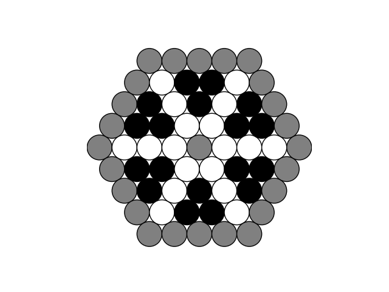

# circaevum-dao-phase-1
The Yin Yang Inspired Smart Contract for Phase 1 of Circaevum's DAO Governance

📌 **Abstract**:
On a Quarterly basis, contributions towards the evolution of Circaevum will be tallied, future work will be scoped, votes will take place, and revenue will be dispersed.

This Yin-Yang inspired model is designed to:
- Provide a framework to simplify and streamline this process
- Incentivize long-term contributions
- Keep the company lean and balanced
- Provide an intuitive model for equity ownership
- Create a valuation method for Phase 1 as a DAO

### Token Characteristics

| Token Type                          | Percentage Cap | # of Tokens Issued | Governance? | Equity? | Profit-Sharing? | Conversion Possible? | Transferable? | Burnable? | Decay Mechanic?                          |
|-------------------------------------|----------------|--------------------|-------------|---------|-----------------|----------------------|---------------|-----------|------------------------------------------|
| Origin                              | 2.71%          | 1                  | ✅ Yes      | ✅ Yes  | ✅ Yes          | ❌ No                | ✅ Yes        | ✅ Yes    | ❌ No                                   |
| Yang                                | 2.7%           | 18                 | ✅ Yes      | ✅ Yes  | ✅ Yes          | ✅ Yes               | ✅ Yes        | ✅ Yes    | ✅ Yes (if inactive before fully earned) |
| Yin                                 | 0.9%           | 54                 | ❌ No       | ❌ No   | ✅ Yes          | ✅ Yes               | ✅ Yes        | ✅ Yes    | ✅ Yes (depletes if inactive)            |
| Dark Matter                         | 0.9%           | 54                | ✅ Yes      | ✅ Yes  | ❌ No           | ❌ No                | ✅ Yes        | ✅ Yes    | ❌ No                                   |
| Origin Orbit                        | 0%             | 36                 | ❌ No       | ❌ No   | ❌ No           | Can Apply to Yin/Yang| ✅ Yes        | ✅ Yes    | ❌ No                                   |
| Mantle Orbit                        | 0%             | Infinite           | ❌ No       | ❌ No   | ❌ No           | Can Apply to Yin/Yang| ✅ Yes        | ✅ Yes    | ❌ No                                   |
---

### Yin-Yang Characteristics
- Yin = adaptive, darkness, source of emergence
- Yen represents the individual. Their contributions can be converted into Yang tokens at a 3:1 ratio.
- This takes up half of a Yin Yang, with a small hole where Yin coagulates into a ball of Yang, which is independent of the other half of the Yin Yang, which also includes a hole
- Yang = conservative, resistant to change, source of decay, full of light and density
- Yang represents the company. The overall company is a ball of energy with inertia, and it needs to shed affectively 1 Yang token per quarter to offer incentive to Yin pool.
- The hole in Yang is to represent the portion of Yang that is lost to make way for the proportional incoming Yang.

Yin-Yang Geometry
- A standard Yin Yang model when examined along a line that bisects each of the smaller circles, there are 6 equal segments of equal length in progression: White, Black, White, and then Black, White, Black. The single Black within the first half represents the diameter of the inner black circle (the Yin [black] within the surrounding Yang [white]). The single White within the second half represents the diameter of the inner white circle (the Yang [white] within the surrounding Yin [black]).
- Using this geometry, we can assume that if the radius of an inner circle is 1 (½ of diameter), then the radius of the full circle is 6. 
- Knowing this, the area of an inner circle is PI*r^2, or in this case PI*1^2. The area of the full circle is PI*6^2. To find the percentage of the inner circle to the outer, we find ourselves with (PI*1)/(PI*36), which simplifies to 1/36, or 2.77%
- If the radius = ½, then the percentage = 0.69%
- If the radius = 1, then the percentage = 2.77%
- If the radius = 2, then the percentage = 11.11%

Corporate Governance Significance
- Yin represents Quarterly accumulated contributions from members of the Circaevum team. This is estimated as points calculated based on the time and rate of influence on Circaevum's growth, which is estimated by the team at the beginning of a quarter when the work is scoped out, and re-evaluated at the end to sure up numbers. 
- Yang represents long-term ownership in the voting rights of the DAO. 
- During a Quarterly review, accumulated Yin contributions can be converted into direct payments (if profits are sufficient), or Yin can be converted into Yang based on the Yin-toYang Conversion Formula

## Growth Progressions
### Outer Core: First 6 team members

Each Outer Core team member can earn up to 5.4% (two Yang tokens), and can be burned at a rate of 0.45% per quarter (0.45% x 6 = 2.7%). In total, their value in the company equals 32.4%. Until the Core is full, each Outer Core member will get 14% of the voting rights, and the Inner Core will get 16% in voting rights to total 100%.

**Round One**
| Member Type    | Count | Voting Power per Member (%) | Total Power (%) |
|----------------|-------|-----------------------------|-----------------|
| Inner Core     | 1     | 16%                         | 16%             |
| Outer Core     | 6     | 14%                         | 84%             |
| **Total**      |       |                             | **100%**        |

### Mantle: Next 12 team members

Each Mantle team member can earn up to 2.7% (one Yang token). Making a total of 18 active slots, the burn rate now decreases to 0.15% per quarter (0.15% x 18 = 2.7%). In total, the Mantle's value in the company also equals 32.4%. Until the Mantle is full, the Core votes will adjust to 7% (Outer) and 10% (Inner), with Mantle votes amounting to 4% each, so the total remains 100%.

**Round Two**
| Member Type    | Count | Voting Power per Member (%) | Total Power (%) |
|----------------|-------|-----------------------------|-----------------|
| Inner Core     | 1     | 10%                         | 10%             |
| Outer Core     | 6     | 7%                          | 42%             |
| Mantle         | 12    | 4%                          | 48%             |
| **Total**      |       |                             | **100%**        |

### Biosphere: Next 18 team members

Each Biosphere team member can earn up to 1.8% (two Yin tokens). Making a total of 36 active slots, the burn rate now decreases to 0.075% per quarter (0.075% x 36 = 2.7%). In total, their value in the company also equals 32.4%. In this phase, everyone gets 2.7%, with the Inner Core at 2.71%, again totaling to 100%.

**Round Three**
| Member Type    | Count | Voting Power per Member (%) | Total Power (%) |
|----------------|-------|-----------------------------|-----------------|
| Inner Core     | 1     | 2.71%                       | 2.71%           |
| Outer Core     | 6     | 2.7%                        | 16.2%           |
| Mantle         | 12    | 2.7%                        | 32.4%           |
| Biosphere      | 18    | 2.7%                        | 48.6%           |
| **Total**      |       |                             | **100%**        |

---

## Quarterly Development Review Sequence

1️⃣ All Revenue enters the Treasury, and payments to Costs for the Quarter are deployed. The remaining Profits will be set aside for Steps 4 and 5
2️⃣ The accumulated contributions of the previous Quarter are tallied up
3️⃣ Yang token holders vote on the next Quarter's needs, and estimated costs are set aside from Profits (Yin equivalents using Yin-toYang formula are included in vote regardless of Yin consumption decision)
4️⃣ 1st half of remaining Profits is set aside for Yin token holders to vote on.
    - Option 1 - Yin holder can convert Yin to Yang for long-term incentives
    - Option 2 - Yin holder can cash out their portion of this 1st half of Profits
5️⃣ 2nd half of profits → Yang holders cash out without losing ownership.

### Contributor's Perspective
Let's look at this model from the individual contributor's perspective. 
If somebody spends 20 hours a week for a quarter, that's about 250 hours. 
The first aproach to this was to aware 0.3% of Voting Rights and Profit-Sharing for every Quarter where a contributor delivered on this level of functionality. 

Another approach is to attribute the Yin and Yang tokens based on systems that need to developed and guaranteed long-term support.

At the end of the day, the goal is to design small lean teams 